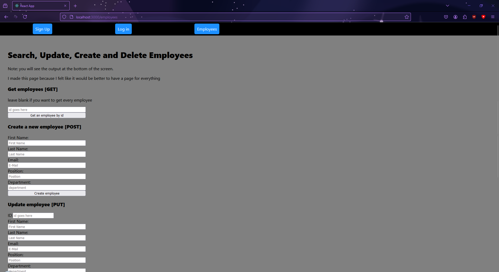
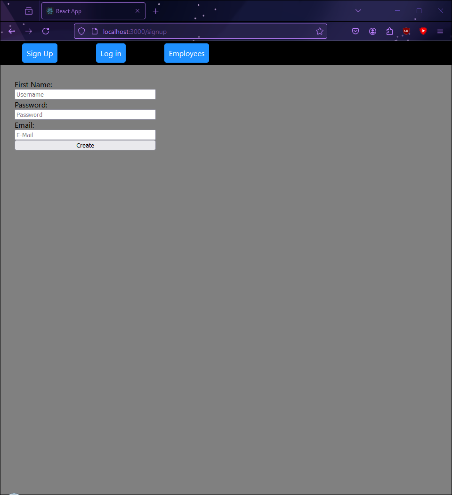
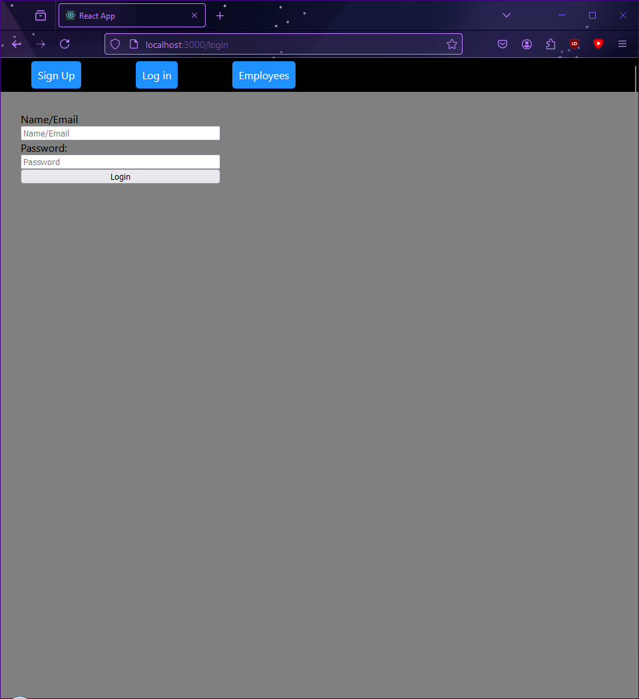

this is just a thing that i made for assignment 2. it contains the entirety of assignment 1 and a react app.

please note that not everything works, the way that they're supposed to

i have the employee routes working mostly fine for this assignment, this is what it looks like

it's just a barebones gui

there's also the login and sign in pages, which are also very barebones, but they don't work properly
 

that's pretty much it